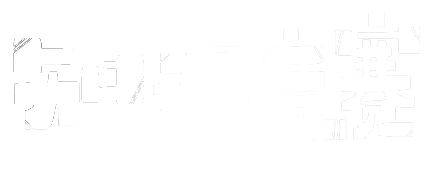

<h1 align="center">
  
</h1>

 

  Hi, I'm zhuohang li, An avid fan of game engines and computer graphics
   
      
  🔬 I am currently a junior student 
     
  🎓 As a dedicated student at Guangdong University of Technology Science, I am constantly challenged and motivated to excel.
   
  💻 I am extremely passionate about everything related to computers
   
  📚 I have a dream: homemade computer, homemade operating system, homemade compiler, homemade programming language, using homemade programming language to write games, using homemade compiler to compile homemade programming language, using homemade operating system to run this homemade game, using homemade computer to run homemade operating system.
   
  💬 Ask me anything about from <a href="https://github.com/Li-ZhuoHang/Li-ZhuoHang/pulls" title="Issues">Here</a>
   
  📫 How to reach me: <a href="mailto: 805557409@qq.com">805557409@qq.com</a>

<h2 align="center">⚡ Stats ⚡</h2>
 

  

    
    
  

           
  

    
  

   
  ### 荣誉奖项
   
   <a href="https://github.com/Li-ZhuoHang/Li-ZhuoHang/blob/master/README.md"><code></code></a> 获得《广东省大学生计算机设计大赛第三等奖》和《广东省机器人与人工智能大赛第二等奖》 
   <a href="https://github.com/Li-ZhuoHang/Li-ZhuoHang/blob/master/README.md"><code></code></a> 《广东工业大学2021-2022学年优秀学生奖学金》和《广东工业大学2021-2022学年学习进步奖学金》 
   <a href="https://github.com/Li-ZhuoHang/Li-ZhuoHang/blob/master/README.md"><code></code></a> 拥有多项项目的开发经验，曾开发过《“文”字》、《人生如戏》、《车道减少场景下的智能网联车辆仿真平台》、《基于DirectX11制作的赛车模拟渲染器》、《魂类游戏》等项目 
   <a href="https://github.com/Li-ZhuoHang/Li-ZhuoHang/blob/master/README.md"><code></code></a> 曾参加过《minigame》、《腾讯高校游戏创意大赛》、《大学生计算机设计大赛》、《机器人与人工智能大赛》等多个比赛 

<h2 align="center">👨‍💻 Repositories 👨‍💻</h2>
 

  
  

      
      
<h4 align="center">
  <a href="https://github.com/Li-ZhuoHang?tab=repositories" title="Show Repositories">🔎 Show More 🔍</a>
</h4>

<!--
**yang-shuohao/yang-shuohao** is a ✨ _special_ ✨ repository because its `README.md` (this file) appears on your GitHub profile.

Here are some ideas to get you started:

- 🔭 I’m currently working on ...
- 🌱 I’m currently learning ...
- 👯 I’m looking to collaborate on ...
- 🤔 I’m looking for help with ...
- 💬 Ask me about ...
- 📫 How to reach me: ...
- 😄 Pronouns: ...
- ⚡ Fun fact: ...

Notes: If you want use this readme, firstly star it please. If you can't align your repositories like this, please change your repository desription to shorter than now. Maybe 4 or 5 word will be good.

-->
